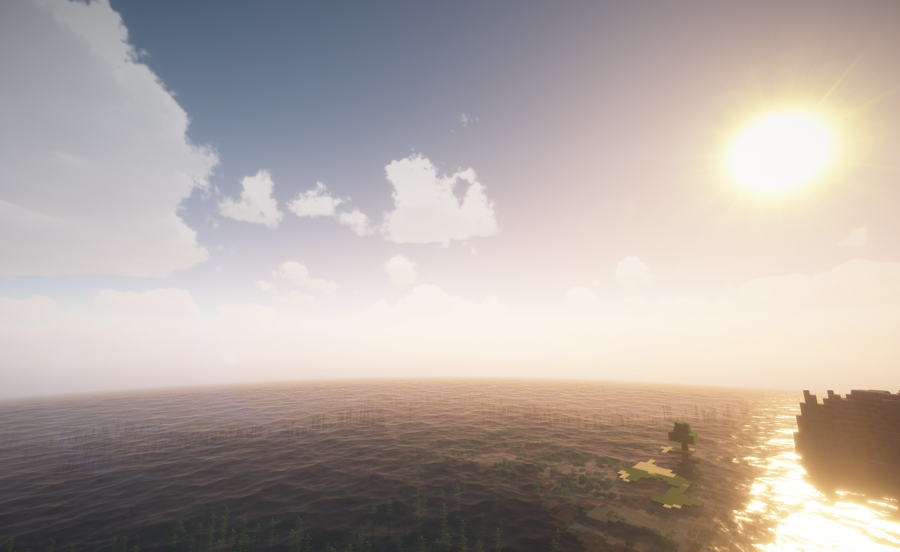

# NeoforgeSkyboxes

#### Unofficial NeoForge 1.21.1 custom skybox support

_Screenshot taken with [Dramatic Sky](https://www.curseforge.com/minecraft/texture-packs/dramatic-skys) resource pack and [BSL shaders](https://www.curseforge.com/minecraft/shaders/bsl-shaders) enabled._

## Purpose

NeoforgeSkyboxes is an unofficial NeoForge 1.21.1 port of Nuit/FabricSkyBoxes, with the OptiFine/MCPatcher skybox compatibility layer merged in.

This mod exists because many custom sky resource packs are available for Fabric/Nuit or OptiFine-style formats, while NeoForge 1.21.1 does not currently have an official Nuit build. If the official project releases an equivalent NeoForge version, this port will be archived.

## Usage

### Nuit skybox format

This mod loads FabricSkyBoxes/Nuit-style skybox resource packs using the `fabricskyboxes` resource namespace.

### OptiFine skybox format

OptiFine/MCPatcher custom sky resource packs are supported through the bundled interop layer.

## Suggestions / Support

Please report issues to this project, not to the official Nuit/FabricSkyBoxes maintainers or resource pack authors, unless the same issue also happens with their official supported loaders.

## Notes

This is a client-side only mod.

## License

This project is licensed under the [MIT License](LICENSE).
